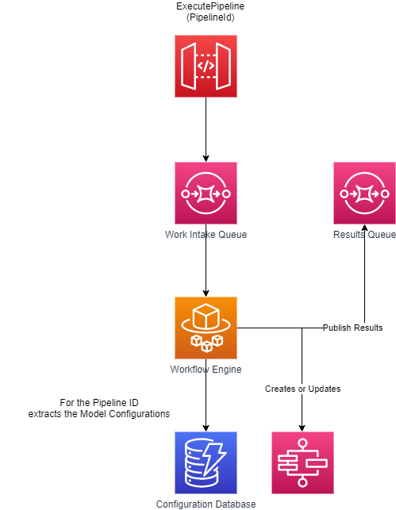

## ML Ops Demonstration

The idea of this is to demonstrate how it is easy to construct, publish and re-use machine learning workflows.  

### Scenario Setup:

The most common ML OPs Scenarios are:

1. Training Pipeline: Train Model, Automatic Tuning, Endpoint config, Deploy Model 
2. Inference :   preprocessing, predictions, and post-processing data science tasks

For this meeting, we have chosen to demonstrate an inference pipeline.

We used a XGBoost Model trained with the below data set and published it in AWS account. 
Data Source: https://archive.ics.uci.edu/ml/machine-learning-databases/breast-cancer-wisconsin/wdbc.data https://www.kaggle.com/uciml/breast-cancer-wisconsin-data

#### Demo User Story:

As a Data Scientist, I have a CSV data collected from one of the hospitals, I would like to check how this data fares against the afore  mentioned trained model. I know the process: I need to validate and cleanse the data, transform it, get predictions from the model. But I dont have the tech know how of writing and deploying a data validation lambda, invoke sage maker prediction apis, read write into s3 via s3 apis. 

Also I would like to make this pipeline as a reusable workflow which can be used by anyone in the org with a similar use case. 

### Implementation:

To address the above requirements, we have developed workflow engine which provides a framework for creating reusable ML components that are essential for ML OPS. 

 It has two major components: 
 Workflow Engine - Orchestrates with other components and builds a sequence of steps as per workflow.  
 StepFactory - A step is a unit of work within a ml workflow (eg: data loader, data transformer). And a step Factory is a component that builds a step based on module definition. 

 The design pattern followed for this engine are: 

 1. Step Factory: Factory Pattern to decide in the Run Time which Step to create. 
 2. StepBuilder: Builder Pattern, To ease the problem of creating a complex Step  
 3. Dependency Injection: This allows the framework to store  workflows and steps config as yaml outside the system and create a step / workflow when required. 

To understand, lets look at couple of scenarios: 

1.  Assuming the reusable module components  exists. New workflow can be created by reusing and chaining these module components.
2. In future - a new ML Capability needs to be added, in that case: 
   1. For eg: Ability to do read Dicom images. Implement the DicomImageReaderStep class in the workflow engine service and now this component can be configured via yaml.   

Here is a brief description of the process flow: 

1. As demoed previously,In the UI, workflow and module configurations are created via the UI and saved in a  dynamodb against a workflow id and module id.

**Example Workflow Config:**

A ML Workflow defines components and how one component relates to another. Initial config flow for demo purposes. However this can be easily extended based on requirements.. 

```yaml
name: CancerPrediction
description: This Pipeline is used for Predicting Cancer.
type: BatchInferencePipeline
Steps:
  DataLoader:
    ModuleId: 12346
    Next: BatchInference
  BatchInference:
    ModuleId: 12347
    Next: ChoiceState
  ChoiceState:
    ModuleId: 12348
    Next: Train Model

```

**Example Model Config:**
Module is self-contained set of code that performs one step in the ML workflow (pipeline), such as data pre-processing, data transformation, model training, and so on. It can be powered by Lambda, ECS, Glue, SageMaker, HTTP Api. Here, we are leveraging Step Function's service integrations to provide re-usable functionalities.  

Each module will have an interface (input/output) specification and an implementation specification 

```yaml
name: BatchInference
description: Predict Result from Input
id: 123e4567-e89b-12d3-a456-426614174000
type: batch_inference
inputs:
  model_name: XGBOOST-BreastCancerPrediction
  instance_count: 1
  input_path: ${context['step_execution']['DataLoader'].output()['Payload']['S3OutputArtifactUri']}
  content_type: ${context['step_execution']['DataLoader'].output()['Payload']['ContentType']}
  output_path: ${context['pipeline_execution']['BaseLocation']}/output

```
As you can see, its possible to refer pipeline level variables or output of another step.  

2. For each module in the workflow config, fetch the module config. 
3. Build a module by using the module config. 
4. Create a workflow using this. 
5. Once the workflow is created, the definition and the template are stored in dynamodb for future use. 

In this Demo, we have implemented the following: 

1. Create and view workflow. 

2. Execute and view workflow execution status. 

   

To scale this component and operate it reliably, we plan to deploy it as a container in ECS fargate which picks  up data from a Work Intake SQS queue and on finishing the workflow will publish to a result queue, which will then be displayed in the UI.



 

